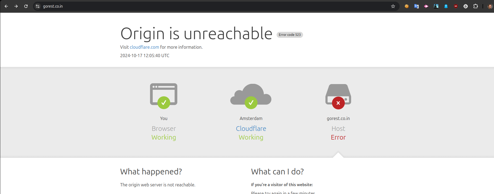

# Eneco

## 1-2) Test Plan & Prioritization

You can look at test plan in [dedicate Tes Plan file](./docs/Test%20Plan%20and%20Prioritization.md)

## Common stuff for 3-4 assigments

### Prerequisites

- Node.js >= 18
- For local usage, update the Bearer Token inside the `.env` file

## Setup the project

1. Clone the repo:

```sh
git clone https://github.com/your-username/gorest-api-test.git
cd gorest-api-test
```

2. After repo is clonned, next step is to install all the packages with:

```
npm install
```

## 3) Gorest API tests

## Setup for the API part

1. Replace `TODO` Bearer Token inside `.env` file with valid one

2. And you can run all the the tests with one command:

```
npm run test:api
```

## 4) Front End Automation

TODO

## P.S.

I have experienced this error during gorest API testing. If API tests are not working please check manually https://gorest.co.in/ to verify that domain at least working

